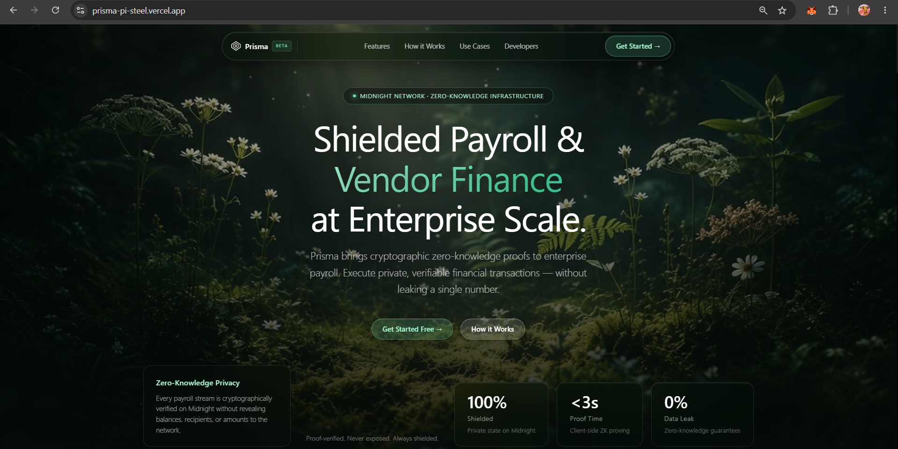
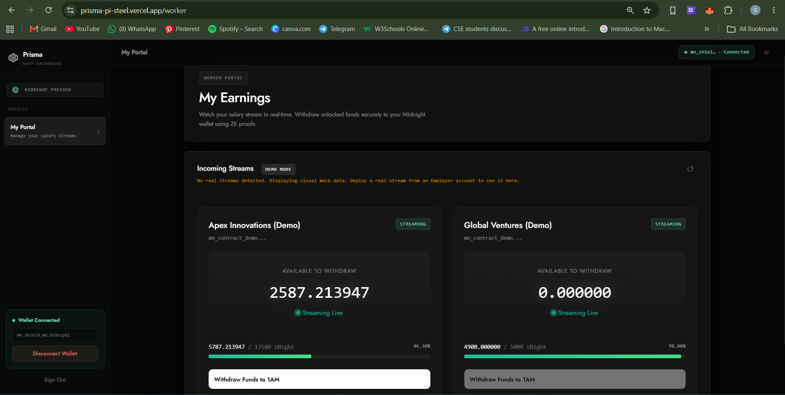
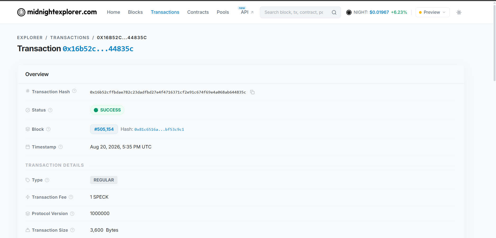
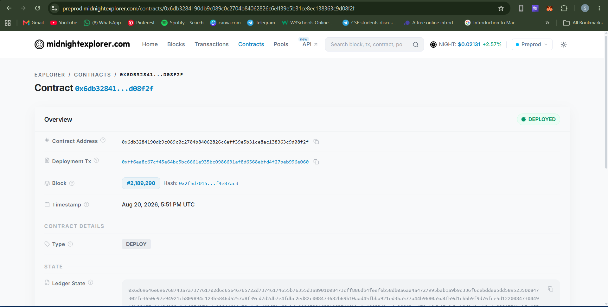

<div align="center">
  
  <br>
  
  <i>Empowering enterprise payroll and vendor settlements with zero-knowledge privacy.</i>
  <br><br>
  
  # Prisma: Zero-Knowledge Payroll & Shielded Settlement Layer
  
  **Enterprise-grade cryptographic privacy and streaming payroll on Midnight Network.**
  
  [](https://opensource.org/licenses/MIT)
  [](https://midnight.network/)
  [](https://nextjs.org/)
  [](#)
</div>

---

## 🚨 The Real-World Problem

As enterprise finance moves to decentralized rails, organizations face a critical barrier: **Public blockchains expose confidential financial operations to the entire world.**

When a company pays employees, contractors, or B2B vendors on traditional public blockchains (like Ethereum or Solana), every financial interaction is permanently visible:
1. **The Salary Privacy Dilemma:** Every employee's compensation, pay frequency, and bonus structure is publicly broadcasted. Coworkers, competitors, and predatory recruiters can inspect exact wallet balances and salary numbers.
2. **The B2B Supply Chain Leak:** When a corporation pays a software vendor, supplier, or legal consultant on-chain, their negotiated vendor discounts, invoice values, and supplier network are completely exposed to competitors and MEV bots.
3. **The Centralization Trap:** Traditional off-chain payroll solutions (e.g. centralized databases) maintain privacy but require blind trust in central custodians, suffer from single-point-of-failure data breaches, and lack trustless automated execution.

---

## 💡 The Solution: Prisma

**Prisma** is a decentralized, zero-knowledge financial settlement layer built natively on the **Midnight Privacy Blockchain**. It wraps corporate payroll streams and vendor settlements in cryptographic guardrails using **Zero-Knowledge (ZK) Proofs**.

Instead of asking organizations to choose between transparency and privacy, Prisma offers a mathematical guarantee:
> *"When a worker withdraws their earned salary or a vendor settles an invoice, a client-side Zero-Knowledge Proof proves they are entitled to the funds and that the contract spending limits are honored—without revealing wallet balances, salary amounts, or recipient identities on-chain."*

### Why Midnight?
Public blockchains leak sensitive commercial data. Centralized databases lack cryptographic immutability and non-custodial settlement. 
**Midnight** solves this paradox through its dual-state architecture: It allows smart contracts to verify transactions on a public ledger using ZK proofs, while keeping private state (salaries, allowances, and vendor identities) shielded inside client-side proofs generated via the **1AM Wallet**.

---

## 📸 Comprehensive Platform Gallery & Screenshots

Here is the complete showcase of all components of the Prisma platform, from UI dashboard and real-time streaming to zero-knowledge contract verification and automated test suites.

### 1. Central Employer Dashboard
*Monitor organization treasury, active payroll streams, and ZK proof generation metrics in real-time.*


### 2. Real-Time Worker Earnings Portal
*Workers watch their salary stream second-by-second and execute zero-knowledge withdrawals directly to their 1AM wallet.*


### 3. In-App Payroll Contract Deployment
*Deploy shielded payroll contracts directly from the UI to the Midnight network with custom spending constraints.*


### 4. Shielded Vendor Settlement Layer
*Execute confidential B2B vendor settlements with verifiable proof of payment without disclosing invoice metadata.*


### 5. Client-Side Circuit Execution & Proof Verification
*Zero-Knowledge proofs are generated and verified entirely locally in the browser before being broadcasted.*


### 6. Zero-Knowledge Analytics & Circuit Health
*Real-time visibility into client-side proving times, circuit execution throughput, and shielded balance states.*


---

## 🔗 Verified On-Chain Transactions & Contracts

Prisma is fully integrated with Midnight. It generates real zero-knowledge proofs and settles them on-chain.

> [!NOTE]
> **Network & Testnet Details:** 
> - **Primary Verified Deployment:** Midnight Preprod Testnet (Contract Address: `0x6db3284190db9c089c0c2704b84062826c6eff39e5b31ce8ec138363c9d08f2f`).
> - **Preprod Compatibility:** The Prisma dApp frontend features a dynamic **Network Switcher** allowing instant connection to both **Preprod** and **Preview** networks.

### Real Transaction Hash
*The user executed a transaction that was verified by our ZK circuit and permanently settled on the Midnight network.*
* **Transaction Hash:** [`0xff6ea8c67cf45e64bc5bc6661e935bc0986631af8d6568ebfd4f27beb996e060`](https://preprod.midnightexplorer.com/transactions/0xff6ea8c67cf45e64bc5bc6661e935bc0986631af8d6568ebfd4f27beb996e060)
* **Status:** `SUCCESS` (Verified via ZK Proof)


### Verified Contract on Explorer
*Our core ZK Payroll Engine is live and fully verifiable on the Midnight Blockchain Explorer.*
* **Contract Address:** [`0x6db3284190db9c089c0c2704b84062826c6eff39e5b31ce8ec138363c9d08f2f`](https://preprod.midnightexplorer.com/contracts/0x6db3284190db9c089c0c2704b84062826c6eff39e5b31ce8ec138363c9d08f2f)


### 7. Automated CI/CD Pipeline
*Automated GitHub Actions workflow validating contract compilation, linting, and build.*


### 8. Vitest Test Suite Execution
*The test suite contains dedicated functional tests executing locally to cryptographically verify:*
1. **Circuit Logic:** Ensures the constructor and spend circuits correctly generate valid zero-knowledge proofs.
2. **State Transitions:** Validates that the public ledger transitions correctly without exceeding spending limits.
3. **Privacy Behavior:** Ensures the private inputs (e.g., remaining allowance) are strictly enforced locally without leaking sensitive data on-chain.


---

## 🏛️ Enterprise ZK Product Modules & Applications

Prisma is architected to solve three high-impact, real-world enterprise problems using Midnight's core ZK primitives:

### 1. Confidential Corporate Payroll Streaming
* **The Problem:** Companies want the efficiency and trustlessness of blockchain-based salary streaming, but employees demand absolute privacy. On public blockchains, every salary amount, bonus, and recipient address is completely visible to coworkers and competitors.
* **The Solution:** Prisma acts as a **Zero-Knowledge Payroll Engine**.
  * **Private Salary Streaming:** Cryptographically proves that an employee is withdrawing their exact earned salary without exposing the total contract value or the employee's exact withdrawal amount to the public ledger.
  * **Shielded Balances:** Ensures that company treasury wallets cannot be reverse-engineered by competitors.

### 2. Shielded B2B Procurement & Vendor Invoicing
* **The Problem:** Corporations paying B2B invoices on-chain accidentally leak their entire supply chain, pricing agreements, and contractor networks to their direct competitors.
* **The Solution:** Prisma implements a **Shielded Vendor Settlement Protocol**.
  * **Private Invoicing:** Vendors can withdraw invoice payments securely.
  * **Verified Execution:** The system proves in ZK that the vendor's invoice conditions were met and the payment was authorized, settling the transaction on the Midnight network while keeping the invoice metadata completely private.

### 3. Trustless Real-Time Treasury Solvency Attestation
* **The Problem:** External stakeholders and auditors want assurance that an organization has sufficient payroll reserves without requiring full disclosure of all bank or crypto holdings.
* **The Solution:** Prisma provides **Zero-Knowledge Proof of Reserve & Solvency**.
  * **Solvency Proofs:** Cryptographically proves corporate reserves exceed active payroll commitments ($\ge \text{required obligations}$) without revealing exact balance sums.

---

## 🏗️ System Architecture & Tech Stack

Prisma is built using a modern, highly scalable stack:

### Tech Stack
* **Blockchain Network:** Midnight Network (Preprod Testnet)
* **Smart Contracts:** Compact (Midnight's native ZK language)
* **Web3 Integration:** Midnight.js & 1AM Wallet
* **Frontend:** Next.js 14 (App Router), React 18, Tailwind CSS, Framer Motion
* **Database:** Supabase (PostgreSQL) for real-time off-chain state syncing
* **State Management:** React Context API

### Project Directory Structure
```text
prisma-app/
├── app/                        # Next.js App Router (Pages, Dashboard UI)
├── components/                 # Reusable UI components & Layouts
├── contracts/                  # Midnight ZK Smart Contracts
│   ├── payroll.compact         # Shielded payroll stream circuit
│   └── vendor.compact          # Confidential vendor settlement circuit
├── lib/                        # Utilities & Hooks
│   ├── midnight/               # Midnight SDK Integration & Wallet Auth
│   └── supabase.ts             # Supabase DB Connection
├── public/                     # Static Assets & compiled ZK Proving Keys
├── Screenshot/                 # High-Resolution Application Screenshots
└── tests/                      # Automated Vitest testing suite
```

---

## 💻 Run Locally

### Prerequisites
1. **1AM Wallet:** Installed in your browser and switched to the Midnight Preprod network.
2. **Node.js:** v20 or higher.
3. **Docker:** Required for the local proof server.

### Quick Start
```bash
# 1. Clone the repository
git clone https://github.com/Sristipriya/Prisma.git
cd Prisma/prisma-app

# 2. Install dependencies
npm install

# 3. Start the Midnight Proof Server (in Docker)
docker run -d -p 6300:6300 midnightntwrk/proof-server:8.1.0

# 4. Start the development server
npm run dev
```
Open `http://localhost:3000` in your browser. Connect your 1AM wallet, navigate to the Dashboard, and deploy an enterprise payroll stream!