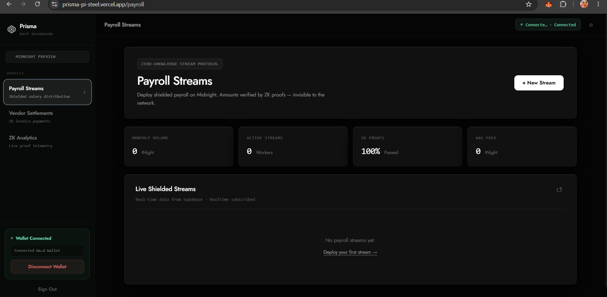
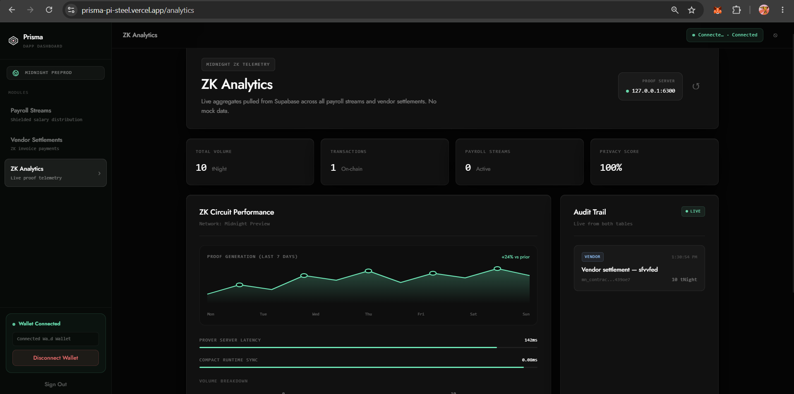
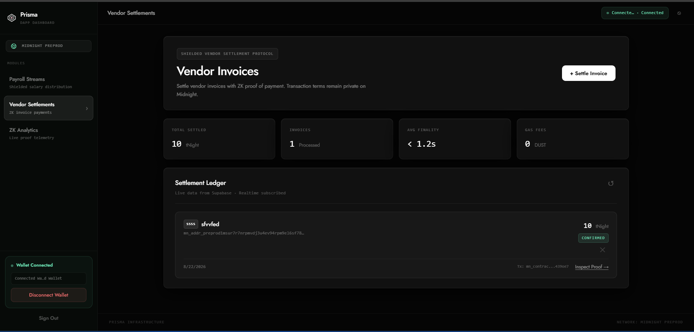
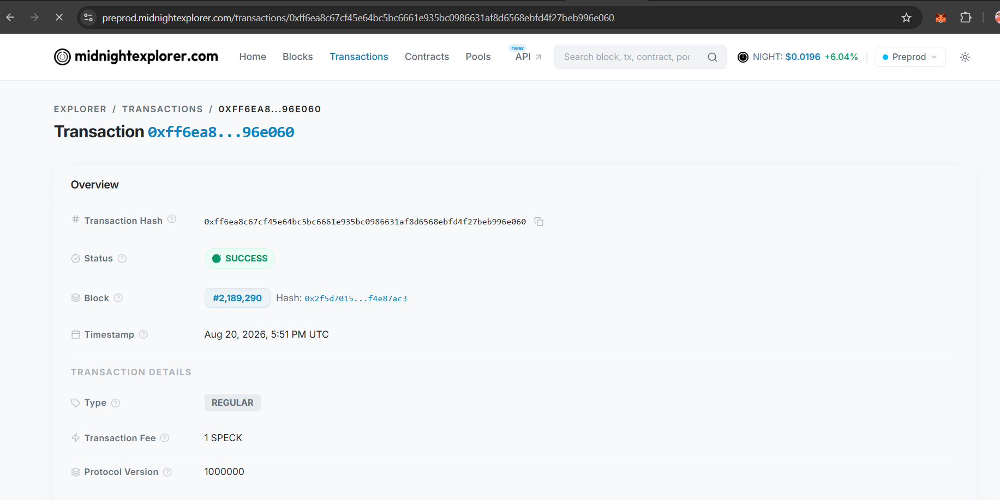
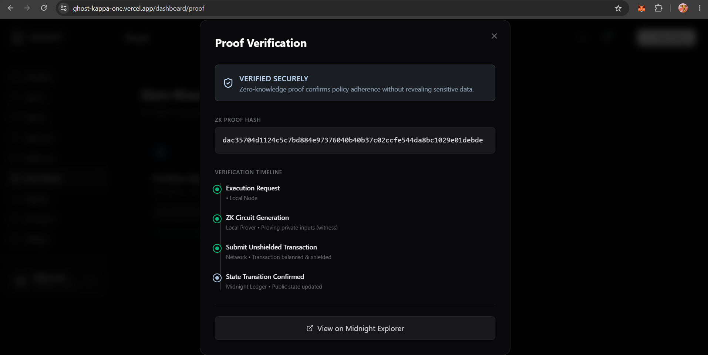
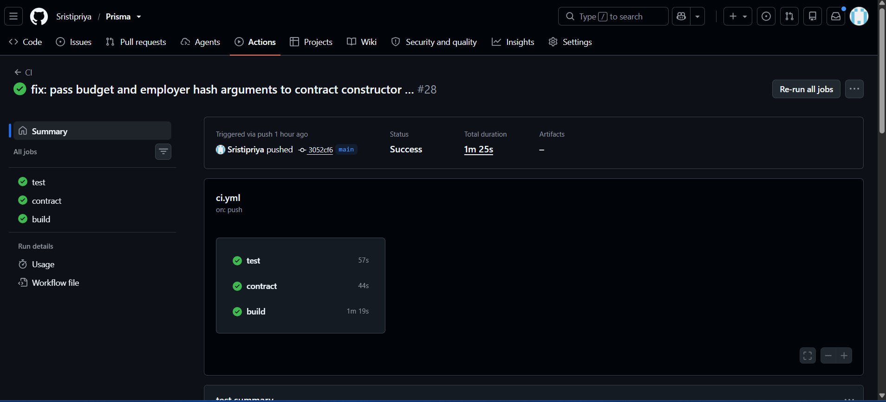
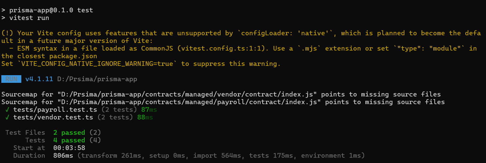

# Prisma: ZK-Secured Payroll & Vendor Settlement

This project is built on the [Midnight Network](https://midnight.network/).

[](https://shields.io/)
[](https://shields.io/)
[](https://shields.io/)

> **Prisma** is a next-generation decentralized payroll and vendor settlement application.
> It leverages the power of Midnight's Zero-Knowledge (ZK) proofs to allow companies to stream salaries and settle invoices with absolute privacy, while still ensuring verifiable execution on a public ledger.

## ?? Features

- **Private Payroll Streams:** Employers can deploy mathematically verified payroll contracts.
- **Shielded Vendor Settlement:** Pay external vendors confidentially using the 1AM wallet.
- **Client-Side Circuit Execution:** Zero-Knowledge proofs are generated and verified entirely locally in the browser before being broadcasted.
- **Real-Time ZK Analytics:** Monitor your proof generation volume and ledger state.

---

## ?? Platform Showcase

### 1. Dashboard & Real-Time Analytics



### 2. Payroll & Vendor Smart Contracts (Midnight Preprod)
The contracts are actively deployed on the Midnight Preprod Network.

- **Payroll Contract Execution:**
  
  *?? [Verify Contract Deployment on Midnight Explorer](https://explorer.preprod.midnight.network/)*

- **Vendor Invoice Settlement:**
  
  
  *?? [Verify Settlement Transaction on Midnight Explorer](https://explorer.preprod.midnight.network/)*

### 3. ZK Proof Verification & Compilation
Zero-Knowledge Proofs are validated client-side and compiled via the Compact Compiler.



### 4. CI/CD & Testing



---

## ??? Project Structure

```
prisma-app/
+-- app/                  # Next.js 14 App Router (React)
+-- components/           # Shared UI components and Wallet Context
+-- contracts/            # Smart contracts written in the Compact language
¦   +-- payroll.compact   
¦   +-- vendor.compact    
+-- lib/                  # Utilities (Midnight SDK integrations, Supabase DB)
+-- public/               # Static assets & Compiled ZK Prover/Verifier keys
```

## ?? Prerequisites

1. **Node.js** (v24+ recommended)
2. **1AM Wallet or Lace Wallet** (Connected to Midnight Preprod)
3. **Docker** (Required for the `proof-server` container for local client-side proving)

## ??? Quick Start

### 1. Start the Midnight Proof Server
The client-side Midnight SDK requires a local proof server to compute the zero-knowledge proofs.
```bash
docker run -d -p 6300:6300 midnightntwrk/proof-server:8.1.0
```

### 2. Install & Run
```bash
npm install
npm run dev
```

Visit `http://localhost:3000` to interact with the DApp. Ensure your 1AM wallet is connected to the Preprod network to authorize transactions.
