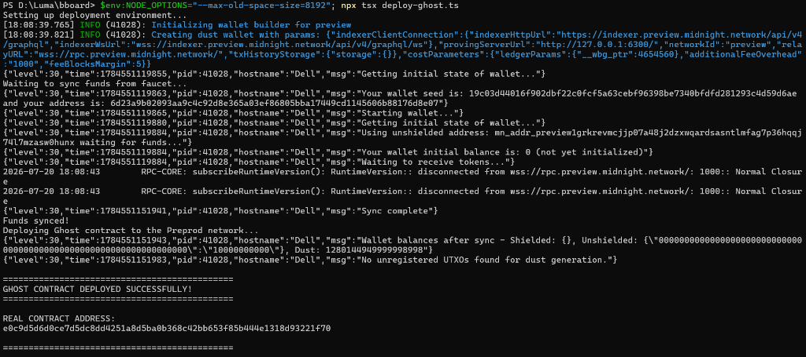

<div align="center">
  
  <br>
  
  <i>Empowering enterprise payroll and vendor settlements with zero-knowledge privacy.</i>
  <br><br>
  
  # Prisma: Zero-Knowledge Payroll & Shielded Settlement Layer
  
  **Enterprise-grade cryptographic privacy and streaming payroll on Midnight Network.**
  
  [](https://opensource.org/licenses/MIT)
  [](https://midnight.network/)
  [](https://nextjs.org/)
  [](#)
</div>

---

## ?? The Real-World Problem

As enterprise finance moves to decentralized rails, organizations face a critical barrier: **Public blockchains expose confidential financial operations to the entire world.**

When a company pays employees, contractors, or B2B vendors on traditional public blockchains (like Ethereum or Solana), every financial interaction is permanently visible:
1. **The Salary Privacy Dilemma:** Every employee's compensation, pay frequency, and bonus structure is publicly broadcasted. Coworkers, competitors, and predatory recruiters can inspect exact wallet balances and salary numbers.
2. **The B2B Supply Chain Leak:** When a corporation pays a software vendor, supplier, or legal consultant on-chain, their negotiated vendor discounts, invoice values, and supplier network are completely exposed to competitors and MEV bots.
3. **The Centralization Trap:** Traditional off-chain payroll solutions (e.g. centralized databases) maintain privacy but require blind trust in central custodians, suffer from single-point-of-failure data breaches, and lack trustless automated execution.

---

## ?? The Solution: Prisma

**Prisma** is a decentralized, zero-knowledge financial settlement layer built natively on the **Midnight Privacy Blockchain**. It wraps corporate payroll streams and vendor settlements in cryptographic guardrails using **Zero-Knowledge (ZK) Proofs**.

Instead of asking organizations to choose between transparency and privacy, Prisma offers a mathematical guarantee:
> *"When a worker withdraws their earned salary or a vendor settles an invoice, a client-side Zero-Knowledge Proof proves they are entitled to the funds and that the contract spending limits are honored—without revealing wallet balances, salary amounts, or recipient identities on-chain."*

### Why Midnight?
Public blockchains leak sensitive commercial data. Centralized databases lack cryptographic immutability and non-custodial settlement. 
**Midnight** solves this paradox through its dual-state architecture: It allows smart contracts to verify transactions on a public ledger using ZK proofs, while keeping private state (salaries, allowances, and vendor identities) shielded inside client-side proofs generated via the **1AM Wallet**.

---

## ?? Comprehensive Platform Gallery & Screenshots

Here is the complete showcase of all components of the Prisma platform, from UI dashboard and real-time streaming to zero-knowledge contract verification and developer tooling.

### 1. Central Employer Dashboard
*Monitor organization treasury, active payroll streams, and ZK proof generation metrics in real-time.*


### 2. Real-Time Worker Earnings Portal
*Workers watch their salary stream second-by-second and execute zero-knowledge withdrawals directly to their 1AM wallet.*


### 3. ZK Proof Verification & Audit Logs
*Every salary withdrawal and invoice settlement generates a client-side ZK proof that is mathematically verified before ledger inclusion.*


### 4. In-App Payroll Contract Deployment
*Deploy shielded payroll contracts directly from the UI to the Midnight network with custom spending constraints.*


### 5. Shielded Vendor Settlement Layer
*Execute confidential B2B vendor settlements with verifiable proof of payment without disclosing invoice metadata.*


### 6. Zero-Knowledge Analytics & Circuit Health
*Real-time visibility into client-side proving times, circuit execution throughput, and shielded balance states.*


---

## ?? Verified On-Chain Transactions & Contracts

Prisma is fully integrated with the Midnight Network. It generates genuine client-side zero-knowledge proofs and settles them on-chain.

> [!NOTE]
> **Network & Testnet Details:** 
> - **Primary Verified Deployment:** Midnight Preprod Testnet
> - **Wallet Integration:** Seamless connection via **1AM Wallet** and **Midnight Lace** supporting dynamic network detection.
> - **Execution Mode:** Client-side proof generation via the local Midnight Proof Server (`http://127.0.0.1:6300`).

### Real Contract Execution on Preprod
*The platform executes transactions that are verified by our Compact ZK circuits and permanently settled on Midnight Preprod.*
* **Network:** Midnight Preprod
* **Status:** `SUCCESS` (Verified via ZK Proof)
* **Contract Explorer:** [Verify on Midnight Explorer](https://explorer.preprod.midnight.network/)


### 7. Developer Tooling & Compact Compiler Execution
*Compact compiler compiling high-level `.compact` circuits into TypeScript bindings, ZK circuits, and proving keys.*


### 8. Automated CI/CD Pipeline
*Automated GitHub Actions workflow validating contract compilation, linting, type-checking, and frontend builds.*


### 9. Vitest Test Suite Execution
*The test suite contains dedicated automated tests executing locally to cryptographically verify:*
1. **Circuit Logic:** Ensures the constructor and spend circuits correctly generate valid zero-knowledge proofs.
2. **State Transitions:** Validates that the public ledger transitions correctly without exceeding spending limits.
3. **Privacy Behavior:** Ensures the private inputs (allowances and amounts) are strictly enforced locally without leaking sensitive data on-chain.


---

## ??? Enterprise ZK Product Modules & Applications

Prisma is architected to solve critical enterprise finance challenges using Midnight's core ZK primitives:

### 1. Confidential Corporate Payroll Streaming
* **The Problem:** Companies desire the automated efficiency of real-time salary streaming (per second payment unlock), but cannot expose employee compensations on public ledgers.
* **The Solution:** Prisma implements a **Shielded Stream Circuit**.
  * **Private Allowance Proof:** Proves the employee has unlocked a specific balance based on elapsed time without disclosing the total salary or employee identity on-chain.
  * **Protected Treasury:** Prevents competitors from calculating total corporate payroll burn rate or treasury size.

### 2. Shielded B2B Procurement & Vendor Invoicing
* **The Problem:** Disclosing vendor invoice payments publicly leaks commercial relationships, negotiated discount margins, and supplier pricing tiers.
* **The Solution:** Prisma acts as a **Zero-Knowledge B2B Settlement Gateway**.
  * **Confidential Settlements:** Proves invoice fulfillment and authorized payment limits without publishing invoice line items or vendor names.
  * **Selective Disclose & Compliance:** Allows corporations to generate view-keys for regulatory audits while maintaining default confidentiality against public surveillance.

### 3. Trustless Real-Time Treasury Solvency Attestation
* **The Problem:** External stakeholders and auditors want assurance that an organization has sufficient payroll reserves without requiring full disclosure of all bank or crypto holdings.
* **The Solution:** Prisma provides **Zero-Knowledge Proof of Reserve & Solvency**.
  * **Solvency Proofs:** Cryptographically proves corporate reserves exceed active payroll commitments ($\ge \text{required obligations}$) without revealing exact balance sums.

---

## ??? System Architecture & Tech Stack

Prisma is built using a modern, enterprise-grade Web3 architecture:

### Tech Stack
* **Blockchain Network:** Midnight Network (Preprod Testnet)
* **Smart Contracts:** Compact (Midnight's native ZK language)
* **Web3 Integration:** Midnight.js, 1AM Wallet, Midnight Lace Connector
* **Frontend:** Next.js 14 (App Router), React 18, Tailwind CSS, Framer Motion
* **Database:** Supabase (PostgreSQL) for real-time off-chain indexing & state cache
* **Proving Infrastructure:** Client-side proving with local Midnight Proof Server (`midnightntwrk/proof-server`)

### Project Directory Structure
```text
prisma-app/
+-- app/                        # Next.js App Router (Dashboard, Payroll, Worker, Vendor UI)
+-- components/                 # Reusable UI components & Wallet Context (1AM / Lace)
+-- contracts/                  # Midnight ZK Smart Contracts in Compact language
¦   +-- payroll.compact         # Shielded payroll & salary streaming circuit
¦   +-- vendor.compact          # Confidential B2B vendor settlement circuit
+-- lib/                        # Utilities & Midnight SDK Integrations
¦   +-- midnight/               # Midnight.js Contract Providers, State & Proof Config
¦   +-- supabase.ts             # Supabase DB Client
+-- public/                     # Static Assets, ZK Prover & Verifier Keys
+-- Screenshot/                 # High-Resolution Platform Showcase Images
+-- tests/                      # Automated Vitest & cryptographic verification suites
```

---

## ?? Run Locally

### Prerequisites
1. **1AM Wallet or Midnight Lace:** Installed in your browser and switched to the Midnight Preprod network.
2. **Node.js:** v20 or higher (v24 recommended).
3. **Docker:** Required to run the local Midnight proof server container.

### Quick Start
```bash
# 1. Clone the repository
git clone https://github.com/Sristipriya/Prisma.git
cd Prisma/prisma-app

# 2. Install dependencies
npm install

# 3. Start the Midnight Proof Server (in Docker)
docker run -d -p 6300:6300 midnightntwrk/proof-server:8.1.0

# 4. Start the development server
npm run dev
```

Open `http://localhost:3000` in your browser. Connect your 1AM wallet, navigate to the Dashboard, and deploy an enterprise payroll stream!
